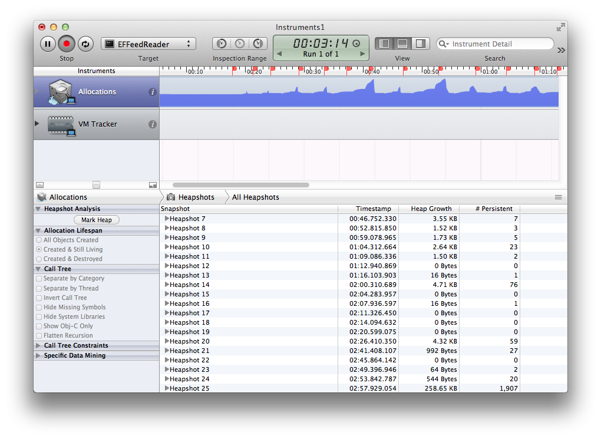

# ADB Feed Reader 
### Author: Alberto De Bortoli


## Summary

A simple and clean RSS Feed Reader for iOS. I'm releasing this project so you can study it and learn how to make apps (or how *not* to make them, depending on what you think of my code). [citation needed][1]

The app has a simple master-detail navigation flow. The feed reader uses *NSXMLParser* with a SAX-style state machine fashion.

Even if the HTTP request to the XML feed is asynchronous (using *NSURLConnection* delegates), the table view is reloaded when all data has been parsed. It would be possibile to handle tableview updates smartly: for example the controller could handle table view insertions as soon as the delegate of the feed reader is notified that a new feed item has been parsed.

## Project

I did not use any important 3rd party library for the main parts of the task (the HTTP request, the XML parsing and the use of Core Data…).

I used Apple *Reachability* class a *NSDate* category I used in my personal projeccts to conveniently format dates.

As an extra, I used also my own *ADBWebBrowserViewController* to load a web page inside the demo app (by pressing the link cell in the detail view).

I used 2 minor external libraries via CocoaPods just for improving UX:

* *MBProgressHUD* (needed by *ADBWebBrowserViewController*)
* *SVPullToRefresh*


## Instructions to use as a third-party component

The main part of the project (the feed parser *ADBFeedParser*) can be easily used as a drop-in component. To use it as a third-party component (refer to `ADBFeedParser.h`) just follow these steps:

* Copy `ADBFeedParser.{h|m}` in your project
* Use the following code to start a parsing against a URL:

```
ADBFeedParser *feedParser = [[ADBFeedParser alloc] initWithURL:aFeedURL];
feedParser.delegate = self;
[feedParser start];
```

* Make your controller conform * to *ADBFeedReaderDelegate* protocol and implement the methods you need for retrieving informations from the feed (the methods are all optional):

```
- (void)feedParserDidStart:(ADBFeedParser *)parser;
- (void)feedParser:(ADBFeedParser *)parser didParseFeedInfo:(FeedInfo *)info;
- (void)feedParser:(ADBFeedParser *)parser didParseFeedItem:(FeedItem *)item;
- (void)feedParserDidFinish:(ADBFeedParser *)parser;
- (void)feedParser:(ADBFeedParser *)parser didFailWithError:(NSError *)error;
```

## Tests with CLANG and Instruments

ADBFeedReader builds with no warnings ('Treat Warnings as Errors' enabled) and passes CLANG static analysis with no warnings. Some checks for allocations and leaks with Instruments have been made with success (see attachment image showing the persistent objects between scrolls).



## License

Copyright (c) 2013, Alberto De Bortoli
All rights reserved.

Redistribution and use in source and binary forms, with or without
modification, are permitted provided that the following conditions are met:
    * Redistributions of source code must retain the above copyright
      notice, this list of conditions and the following disclaimer.
    * Redistributions in binary form must reproduce the above copyright
      notice, this list of conditions and the following disclaimer in the
      documentation and/or other materials provided with the distribution.
    * Neither the name of Alberto De Bortoli nor the
      names of its contributors may be used to endorse or promote products
      derived from this software without specific prior written permission.

THIS SOFTWARE IS PROVIDED BY THE COPYRIGHT HOLDERS AND CONTRIBUTORS "AS IS" AND
ANY EXPRESS OR IMPLIED WARRANTIES, INCLUDING, BUT NOT LIMITED TO, THE IMPLIED
WARRANTIES OF MERCHANTABILITY AND FITNESS FOR A PARTICULAR PURPOSE ARE
DISCLAIMED. IN NO EVENT SHALL Alberto De Bortoli BE LIABLE FOR ANY
DIRECT, INDIRECT, INCIDENTAL, SPECIAL, EXEMPLARY, OR CONSEQUENTIAL DAMAGES
(INCLUDING, BUT NOT LIMITED TO, PROCUREMENT OF SUBSTITUTE GOODS OR SERVICES;
LOSS OF USE, DATA, OR PROFITS; OR BUSINESS INTERRUPTION) HOWEVER CAUSED AND
ON ANY THEORY OF LIABILITY, WHETHER IN CONTRACT, STRICT LIABILITY, OR TORT
(INCLUDING NEGLIGENCE OR OTHERWISE) ARISING IN ANY WAY OUT OF THE USE OF THIS
SOFTWARE, EVEN IF ADVISED OF THE POSSIBILITY OF SUCH DAMAGE.


[1]: https://github.com/nicklockwood/Concurrency/blob/master/README.md
